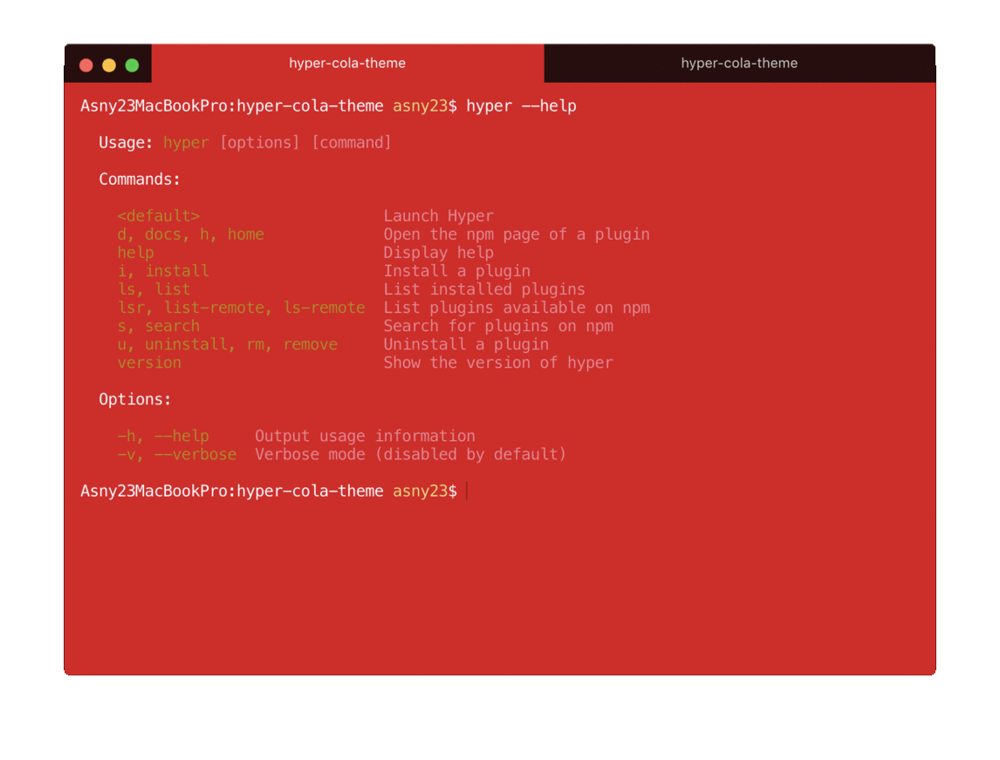

# hyper-cola-theme

Cola-inspired color theme for [Hyper](https://hyper.is)




## Installation

Open `~/.hyper.js` file then add `'hyper-cola-theme'` to `plugins`.

```js
module.exports = {
  ...

  plugins: [
    ...
    'hyper-cola-theme',
    ...
  ],

  ...
};
```


## Configuration
1. Open `~/.hyper.js` file then add `hyperColaTheme: '<scheme>'` to `config`.

```js
module.exports = {
  config: {
    ...

    // set color scheme 'red' or 'dark'
    // default is 'red'
    hyperColaTheme: 'red',

    ...
  },
};
```
2. Restart Hyper
